**导读：**阅文作为国内最大的网络文学公司，我们在实践过程中，总结了一套适合自身业务特点的用户画像方法论，及实践经验。本文将介绍为什么需要用户画像，以及如何做用户画像，并结合在阅文场景下所面临的问题，为大家分享下我们在用户画像上的探索与实践。

## 背景介绍

**1. 关于阅文**

阅文集团是国内最大的网络文学公司，有很多原创文学品牌，包括起点中文、创世中文、起点海外、以及云起书院等；也有几款用户量很大的阅读类APP，包括起点读书、QQ阅读、红袖读书等。另外还有自己一些上下游的企业，如影视制作发行公司新丽传媒。这些都是我们用户画像的应用场景。

**2. 阅文智能业务中心**

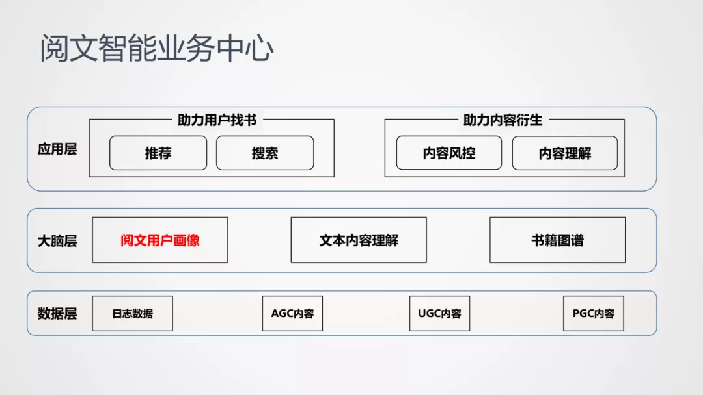

阅文智能业务中心的整体架构主要分为：数据层、大脑层和应用层。

**① 数据层**

包含了智能业务中心可以采集到的各种带有数据属性的数据。这里AGC数据是作家创造的网文内容，UGC数据是观众或读者，在评论区、书评区、书单等产生的UGC内容。

**② 大脑层**

是智能业务中心的基础，主要解决对用户的洞察，以及对文本内容的挖掘和理解。今天要分享的用户画像就处在这一层。

**③ 应用层**

赋能给各处的应用，主要包括两类：

- 一类是助力用户找书：助力用户更好的找到想看的书，助力用户浏览阅读体验的提升。主要包括推荐、搜索、精细化运营等。
- 一类是助力内容衍生：助力实现整体内容延伸，包括内容理解和内容风控等。

下面给大家详细介绍下我的一些思考和做用户画像整体的方法论，以及在阅文的探索和实践。

## 思考和方法

****

**1. 思考：画像为何存在**

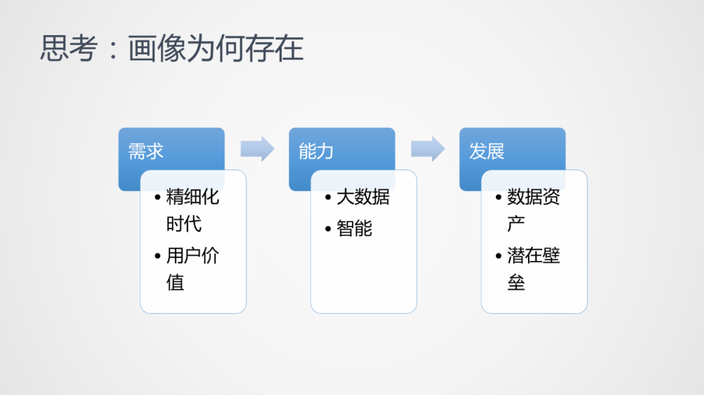

**① 需求：**

**精细化：**

互联网时代已经走过了原来的野蛮增长过程，大家手机上虽然装了很多APP，但可能很多APP是不会打开的。这导致如果APP A想要获取流量，会找APP B把流量给获取过来，而不是因为流量红利的存在，有很多用户会主动安装一些新的APP。所以我们从增量时代，来到了精细化时代。这时，用户画像显得非常重要，如何能够更好的洞察用户意图，理解用户背后隐藏的意图以及对用户标签的洞察，可以很方便的助力整体业务的发展。

**用户价值：**

另外，现在用户的价值越来越细分也越来越多维。在精细化时代，C端的用户价值往往会偏向于B端的应用场景。比如下面这个问题：

有很多的内容要改编成电视剧、游戏、电影、动漫。那么，什么样的内容适合改编？这些内容到底能够带来多少价值？价值如何定义？这时，我们发现用户价值往往起到了决定性的因素。

比如一部网文吸引的读者，都是年轻化的读者，如在校学生或者初入职场的毕业生等。那么，这部网文就适合改编成励志剧或者校园情景剧，它的想象空间和受众的广度，就可以提前洞察到，便于在改编时有一定的用户基础。杜绝了"直接拍脑袋改编剧集，再去看市场反映"情况的发生。这就是用户画像在用户价值方面的体现，可以很好的帮助网文的改编。

**② 能力**

有了需求以后，在我们的业务场景，能够把用户画像建起来么？早在我10年加入百度时，百度已经开始做用户画像的整体建设了，由于百度是做精准广告出身的，这就需要精准的用户洞察。这时，外面很多的小公司还没有对用户画像进行建设，一是因为数据量可能没有那么大，二是因为自身的算法模型还没有完备。随着阅文业务的数据量越来越大，结合算法模型能力的提升，可以精准的挖掘出背后隐含的用户意图。

**③ 发展**

**数据资产：**

用户画像是公司对未来发展的重要基础。用户画像聚集了"上帝"，因为我们做所有的APP都是为用户服务的，希望给用户提供更好的体验。这些"上帝"形成的画像，无形中成为了公司的资产，这在每个公司都是适用的。

**潜在壁垒：**

在资产之上可以衍生出更多的产品，这就形成了潜在的壁垒。对于阅读领域，我们有自己对画像的提炼，可以对国内用户的阅读倾向，有更深刻的洞察和理解，这样就形成了公司的壁垒。我们再以字节跳动为例，字节跳动一开始只有今日头条一个主APP，但在主APP的发展过程中，他们积累了很多用户的精准画像，如用户A喜欢车，用户B喜欢短视频，在这基础上，使得字节跳动孵化出了抖音短视频和懂车帝，这背后都跟用户的精准洞察是息息相关的。

这就是我们为什么要做用户画像的一个原因。

画像如何来做：

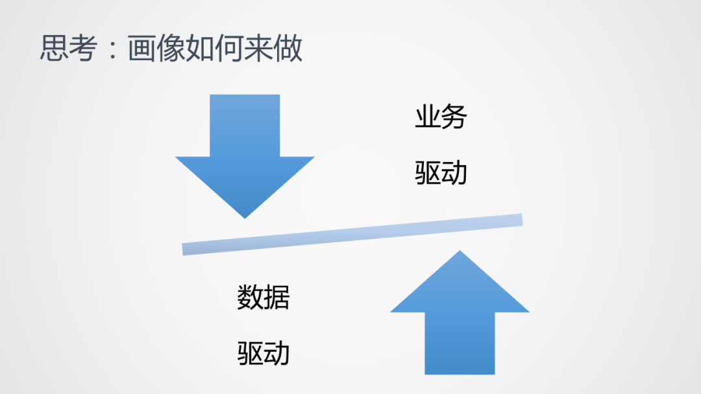

我们知道了为什么要做用户画像，那如何来做用户画像？如何构建用户画像标签体系？是数据驱动？还是业务驱动？

**① 数据驱动**

从Bottom to Up，也就是自底向上 ( 自下而上 )。那么底是什么？底是公司所有的数据资产，是由数据驱动，可以发现用户有哪些规律，找到用户画像的隐含标签。这是一种方法，从数据驱动去解决，可以看到用户有哪些标签。

**② 业务驱动**

所有的业务对用户画像都有一定的导向性。因为技术总归要应用到某些特定的场景，如某些B端场景应用价值的评估。这时要看业务想要聚合哪一类型的用户，需要找到这些用户。这就是以业务为驱动，来找到下游要做怎样的标签体系。

**3. 方法：数据驱动+业务驱动**

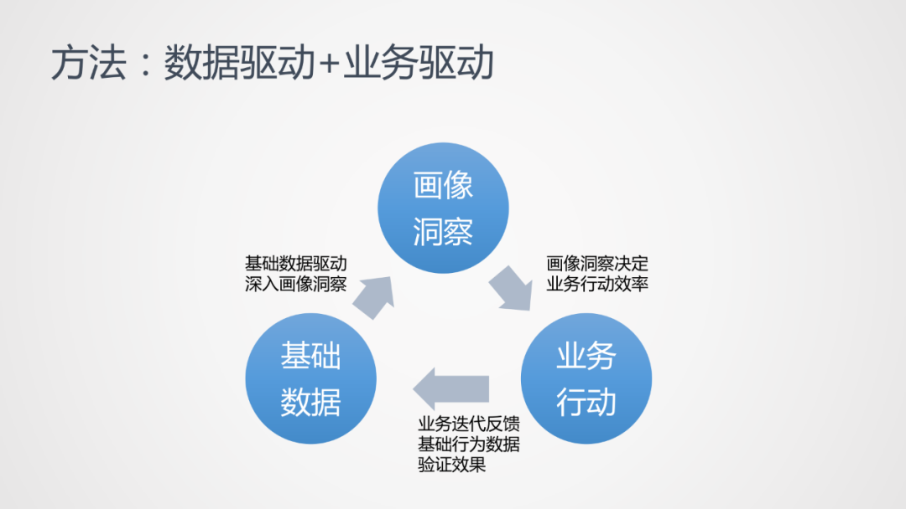

一般来说，用户画像是业务驱动或者数据驱动的。而在做阅文整体的用户画像时，考虑的是业务和数据相结合。

基础数据驱动的用户画像洞察，当提炼出一些标签以后，会决定业务行动的效率。比如对流失了3天的用户，要做一些促活的活动，先会通过数据提炼出流失3天的一些用户，去做用户激活，比如push ( 消息推送 )，进行push之后可以拿到基础数据反馈的结果，从而更好的驱动用户画像标签的优化。

进一步，如果最终画像标签是为了促活而使用的，那么我们可不可以预测下，哪些用户有存在流失的可能性，而不仅仅只是从基础数据得到自己流失3天的、被定义为将要流失的用户。这样就形成了正向的闭环，可以有效的提升画像标签的精准性，并提升用户画像的价值，可以更好的解决业务面临的一些问题。

## 探索和实践

前面讲述了对用户画像整体的总结与思考，也就是总的纲领，现在展开讲一下我们的一些探索和实践。

**1. 背景**

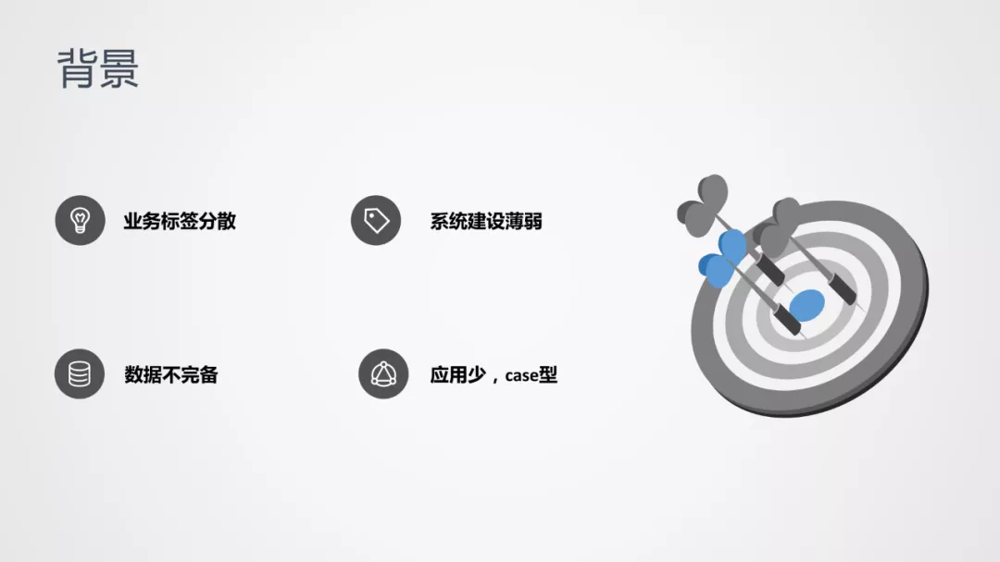

阅文用户画像建设的背景：阅文集团旗下有多款阅读类APP，虽然在国内网络文学领域占了绝对的领先位置，但有很多独立的APP，导致标签无法单独成为统一的、独立于APP而存在的体系，这导致了以下几个问题：

- 业务标签分散：每个APP都有自己定义的业务标签体系和业务表现。可能都存在自己业务线的用户标签或用户画像，没办法形成合力。
- 系统建设薄弱：在之前所有的系统建设上，存在着很多薄弱的环节，很多大数据的组件都是没有的，如实时数据的整体实时数据流、离线的挖掘系统等，都是一种算力的缺失。
- 数据不完备：做用户画像时，考虑更多的是全局，但割裂的数据会导致信息都是不完备的，没办法学习整体用户画像。
- 应用少，case型：用户画像的应用较少，以case型为导向。

**2. 方法：收敛，基建，应用，反馈**

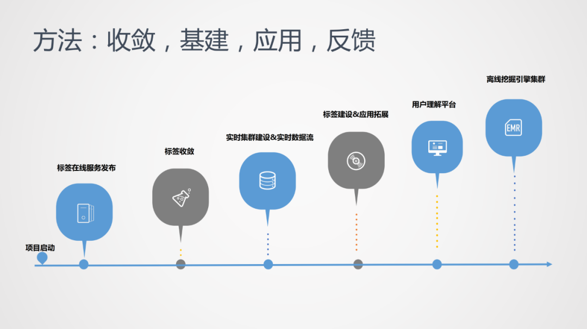

具体如何解决这些问题，更好地建设和应用用户画像，我们在此做了一些关键节点的罗列：

- 标签在线服务发布：我们发现标签最主要的应用是在推荐场景中，且更多是标签在线服务的应用，这时就需要发布整体的标签在线服务，以便对所有标签的在线调用进行统一收口。以前对A的推荐可能会调底层Cache Redis中的一些表边或线上的接口，导致所有的调用是比较混乱的。于是我们采用了先把用户画像的在线服务接口发布出来，让所有的标签推荐、后端应用，所调用的接口都进行统一收口。
- 标签收敛：因为业务标签都分散在各个方面，因此我们希望整合这种标签。有调用的收敛以后，我就可以把事情整合起来，因为有上游的日志来圈，到底哪些标签是被调用的，哪些标签没有被调用。底层的标签可以跟业务口有一道屏障，能够把东西给屏蔽掉，只对底层的标签来做一些收敛工作。
- 实时集群建设&实时数据流：接下来，我们解决了工程实践上的一些短板，比如刚才讲到的实时集群和对实时数据流的诠释。我们引入了外部的一些开源的大数据实时流系统，建立了自己的一套实时数据流。
- 标签建设&应用拓展：在有了实时数据流后，我们可以建立实时类的标签，当有了标签的收敛后，就可以扩展到更多的应用，来调用我们的接口，这里主要体现在精细化运营上的一些拓展。
- 用户理解平台：有了整体的系统以后，我们搭建了自己的用户理解平台，何为理解平台？一是为了更好的追踪数据质量，二是在这上面能够做一些简单的应用，或者简单的用户整体分析，供给B端进行使用，直接在我们的用户理解平台上解决问题。
- 离线挖掘引擎集群：这块是今年上半年主要做的，我们原来所有的数据流都是以Kappa架构来解决问题，也就是以实时数据累加的形式来解决标签的建设。从今年开始逐渐把架构改成了Lambda结构，希望引入离线挖掘引擎的集群，获得大规模计算的能力，解决更复杂的模型挖掘与数据挖掘工作。

**3. 用户画像系统全貌**

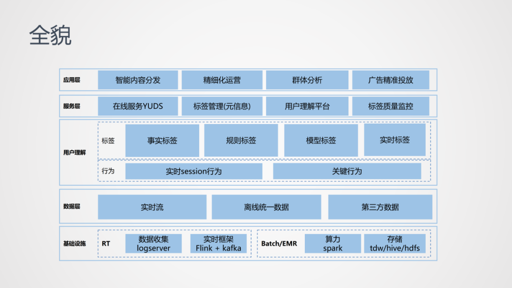

简单看一下用户画像系统的全貌：

**① 基础设施**

基础的算力依赖，主要包括：

- 实时依赖。主要是我们自建的数据采集框架和Flink Kafka实施框架。
- 离线依赖。主要采用了spark集群，并复用了腾讯tdw的存储资源。

**② 数据层**

包括实时流、离线统一数据、第三方数据。这里说一下离线统一数据：

以前更关注的是离线数据，但是当APP越来越多以后，各个端的离线数据口径和埋点是不一致的，有非常大的挑战，特别对于成熟的公司做用户画像时，会发现这一块最耗费精力，因为要对所有的数据口径进行梳理。所以这块未来希望有一套统一的离线数据来支持上层整体的用户画像应用。

**③ 用户理解层**

在数据层上面，再会构建自己的用户理解层，基于数据去理解用户。主要包括行为和标签。

**行为：**

因为有些行为是有强意图的，我们希望把强意图的行为也能够直接积累起来，并在上游直接应用。行为主要包括实时session行为和关键行为。

- 实时session行为：基于session可以挖掘到上游更多的意图，还可以基于session进行线上调整，应用于精细化运营和推荐等。
- 关键行为：需要累积好，对上游的应用或者精细化运营有非常大的应用场景。有业务需要调用时，可以直接复用这种关键行为。基于这种行为以后，我们才会去挖掘标签体系或者挖掘用户画像。

**标签：**

对于标签，主要包含了4类：

- 事实标签：一些更偏事实类的标签，比如用户是什么等级的用户
- 规则标签：就是通过一定的规则计算出来的标签
- 模型标签和实时标签：通过模型挖掘的标签，以及可能服务于具体业务的实时标签。

**④ 服务层**

在用户理解的基础上，我们可以提供各种服务：在线服务YUDS ( 统一收口服务 )、 标签管理 ( 很多标签业务用过以后，下次再用时不知道标签是什么含义了，希望有一套标签元信息的管理，能够很好的管理起来，达成标签的更强复用 )、用户理解平台以及标签质量监控 ( 监控标签的质量，调优标签的结果 )。

**④ 应用层**

这里不再细讲，在后面会展开一下。以上，就是我们用户画像系统的全貌，下面再详细为大家介绍下：

**4. 基础：不可忽视的数据建设**

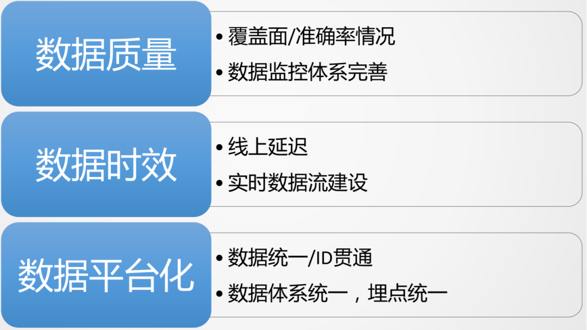

万丈高楼平地起，没有数据，画像都是无根之草。对于数据建设会强调几个方面：

- 数据质量：如何保证数据的覆盖面和准确率？这需要一套完整的数据监控体系，通过数据监控体系完善数据的覆盖面和准确率。比如能够通过数据监控体系看到每次发版灰度流量时，数据有没有变少，覆盖面有没有降低，准确率有没有降低等。

- 数据时效：线上延时可能会导致采集的数据延迟。我们希望能够尽量解决，而不是像以前一样小时级别来导一次数据，数据时效性无法满足线上的需求。这块重点在于实时数据流的建设。

- 数据平台化：对于集团类公司，有很多类型APP时，这一点是非常重要的，要解决数据的统一问题。再就是ID的贯通，在很多的业务、场景、APP都需要ID贯通，需要有一定的手段解决ID贯通的问题。

  这些都需要对数据体系进行统一，我们从19年开始，就一直在做数据收敛和埋点的统一。只有数据的统一，形成整体的平台化以后，用户画像才能更好的解决集团整体的一些问题。

**5. 支撑：架构建设**

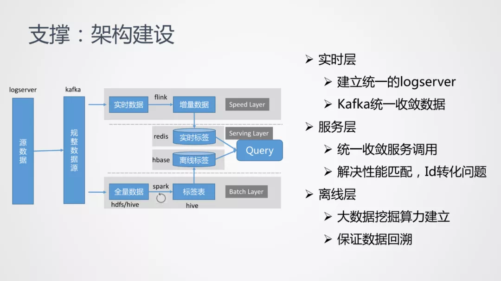

有了数据的基础后，就是对工程架构的建设。在业内主要有两种工程架构：

- Lambda架构：包括实时层、服务层和离线层
- Kappa架构：没有离线层，所有的数据都是从实时层进行累积，再通过Server层直接出去

我们的架构是从Kappa架构过渡到Lambda架构的：

- 离线层：我们希望有离线的大数据挖掘能力，因为在线时，发现很多模型类的标签没办法通过在线直接挖掘来。另外，我们希望保证数据回溯。有时标签会改掉一些定义或者手段，我们希望对所有的数据进行重刷，这时在开发架构中，重刷会遇到很大困难，但在Lambda架构，可以比较方便的做整体的重刷。
- 实时层：主要是在工作时建立统一的Logserver，收敛整体数据流的采集，当采集完以后到Kafka做一层规整，由Kafka分别导给实时层、离线层等。在实时数据流中，主要采用的是通过Flink框架来解决实时数据的挖掘。
- 服务层：主要解决统一收敛服务的调用，所有外界的服务调用都统一通过这个调用口进去，这样可以很好地屏蔽上层业务层和底层标签建设，不会影响业务工作。另外，我们还会解决ID转换、性能匹配等工作。

**6. 内容：标签建设**

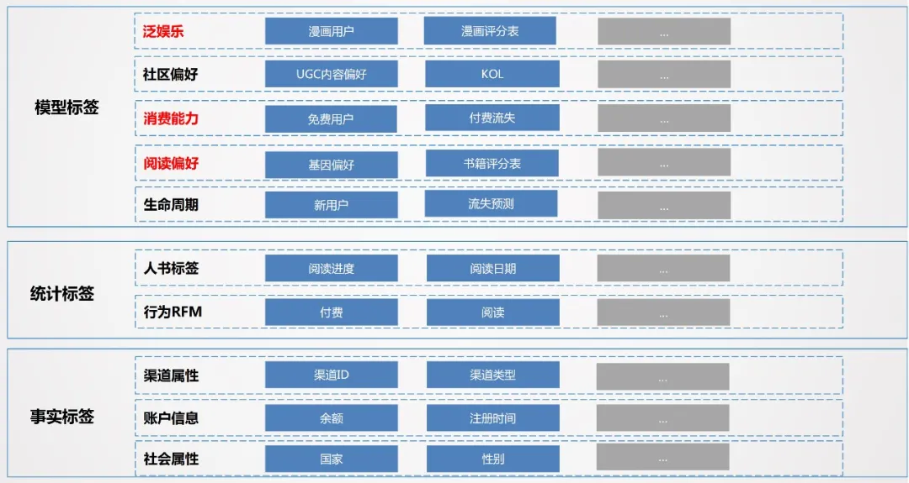

有架构以后，要填充内容，内容其实就是标签。刚才在全貌中大家也看到了，有事实标签，规则标签 ( 统计标签 )，还有模型标签和实时标签。这里重点展开讲一下阅文特有的模型标签，阅读偏好。因为我们是属于阅读业务领先的公司，主要解决的是用户阅读类型问题。

- 阅读内容偏好：比如用户是喜欢阅读历史类、文娱类、搞笑类的书，还是庆余年这种架空历史类型的书，这就是阅读内容偏好
- 阅读时间偏好：比如用户在什么时间点经常会来看书
- 阅读习惯偏好：有些用户在看书时，只看连载完结书，觉得完结书看起来比较爽，不需要追连载。
- 阅读字数偏好：有些老用户可能当网文积累到一定字数才会看，因为这样老用户会觉得这本书写的还可以，是被验证过的。
- 阅读行为偏好：有些用户在阅读时，会先翻一翻，挑到最后几章、最新的几章看一看，再来决定看不看这本书。这种都是用户阅读行为上的习惯，这需要我们通过数据挖掘的手段来掌握用户的阅读行为偏好。
- 付费阅读偏好：是消费能力的一些积累。后面还有一些泛娱乐的标签，是因为我们的内容形态不仅有网文还有漫画等。

**7. 价值：应用**

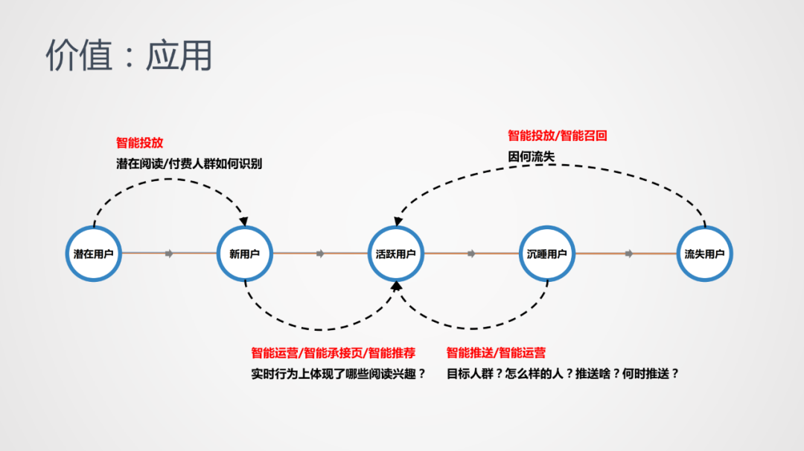

用户画像的应用价值在哪里？我们通过整体的用户生命周期就可以很容易看出用户画像的价值。从潜在用户到新用户，可以识别潜在阅读/付费人群，来进行智能投放；从新用户到活跃用户，可以通过实时行为看出用户的阅读兴趣，来进行智能运营、智能承接页、智能推荐等；还包括未来的流失召回，以及自己用户的激活都跟用户画像息息相关。

**8. 反馈：验证+闭环**

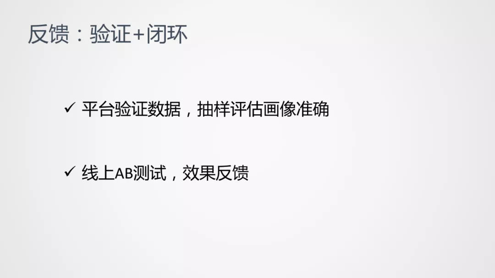

对于建设整体的标签体系，反馈是非常重要的一环，用来保证用户画像的准度。主要方法有：

- 平台验证数据，从用户理解平台抽样评估数据、画像到底准不准
- 线上的AB测试，得到数据效果，可以更好的验证模型标签打的是否准确

## 未来展望

未来展望分为两点：

**1. 技术突破，奠定泛娱乐的用户画像之基**

对基础技术进行突破，奠定泛娱乐的用户画像之基。什么是泛娱乐的用户画像之基？除了网文，我们还有游戏、漫画、动画、影视，是否有一种整体的用户画像基础，可以承接整体泛娱乐场景的用户洞察，这是技术上会考虑的问题。

**2. 业务赋能，打造用户全生命周期的赋能**

刚刚在应用价值中，有讲到把用户整体生命周期串起来看，用户画像能在某个点、某个场景中进行进一步的赋能。在这里，我们希望可以跟业务有强绑定，通过推荐、精准的精细化运营等手段，解决线上的用户全生命周期的管理及赋能问题。