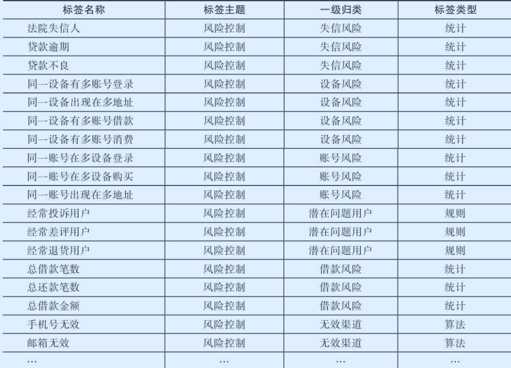
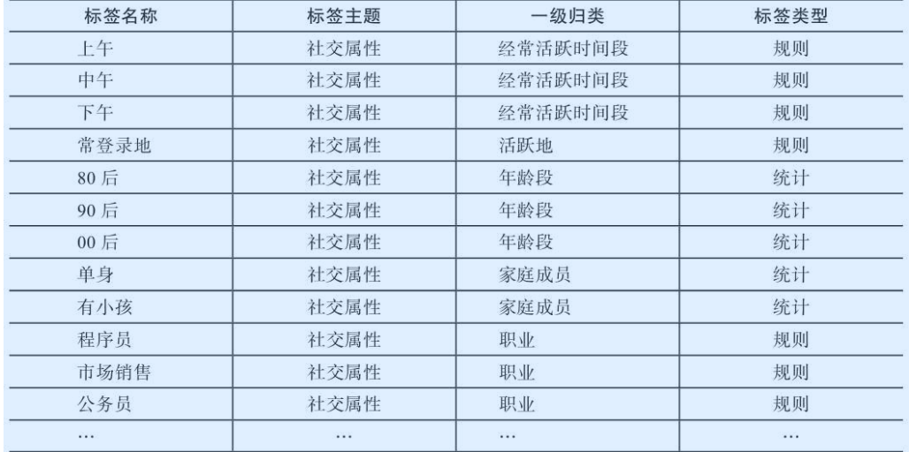
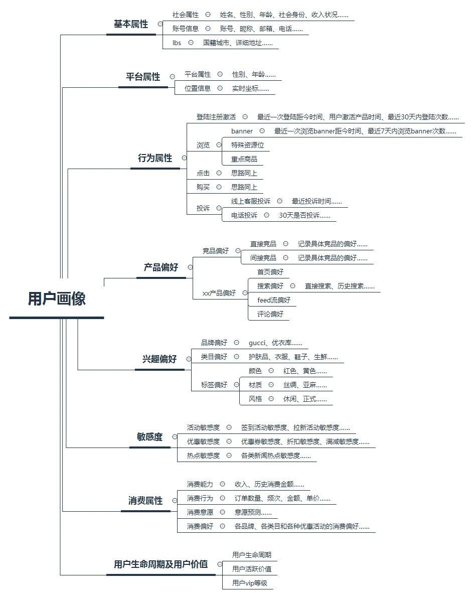

* [数据标签体系](#数据标签体系)
  * [数据架构](#数据架构)
  * [标签类型及命名方式](#标签类型及命名方式)
    * [标签类型](#标签类型)
    * [标签命名方式](#标签命名方式)
    * [标签命名](#标签命名)
  * [标签维度(主题)](#标签维度主题)
    * [用户属性维度](#用户属性维度)
      * [常见用户属性](#常见用户属性)
      * [用户性别](#用户性别)
    * [用户行为维度](#用户行为维度)
      * [常见用户行为标签](#常见用户行为标签)
    * [用户消费维度](#用户消费维度)
      * [常见用户消费维度标签](#常见用户消费维度标签)
    * [风控维度](#风控维度)
    * [社交属性维度](#社交属性维度)
    * [其他常见标签划分方式](#其他常见标签划分方式)
      * [基本属性](#基本属性)
      * [平台属性(购物属性)](#平台属性购物属性)
      * [行为属性](#行为属性)
      * [产品偏好](#产品偏好)
      * [兴趣偏好](#兴趣偏好)
      * [敏感度](#敏感度)
      * [消费属性](#消费属性)
      * [用户生命周期及用户价值](#用户生命周期及用户价值)
  * [总结](#总结)

# 数据标签体系

>用户画像作为当下描述分析用户、运营营销的重要工具，被全部互联网人熟知，用户画像的定义并不复杂，是系统通过用户自行上传或埋点上报收集记录了用户大量信息，为便于各业务应用，将这些信息进行沉淀、加工和抽象，形成一个以用户标志为主 key 的`标签树`，用于全面刻画用户的属性和行为信息，这就是用户画像。
>
>参考资料：[用户画像](https://www.bilibili.com/video/BV1pJ411A7Mr?from=search&seid=4731934929654946629)、[用户画像从0到100的构建思路](https://mp.weixin.qq.com/s/mkqSuqKB08m4iRWwzmy2Fw)

## 数据架构

- 下面虚线框为常见的数据仓库ETL加工流程，将每天的业务数据、埋点数据、日志数据经过数仓建模处理，加工到对应的数仓ODS、DWD、DWS层。
- 中间虚线部分为用户画像建模的主要环节，画像数据不是产生数据的源头，而是对数仓的ODS、DWD层等数据做二次建模加工，将用户标签计算结果写入到Hive，最后基于不同的数据使用场景，进一步将数据同步到Mysql、HBase、ES等数据库中。
  - Hive：存储用户标签计算结果、用户人群计算结果、用户特征计算结果。
  - Mysql：存储标签元数据
  - Hbase：存储线上接口实时调用类数据
  - ES：支持海量数据的准实时查询分析，用户存储用户人群计算、用户群透视分析所需的用户标签数据。
- 用户标签数据在Hive中加工完成后，部分标签导入到提供BI展示、多维透视分析数据、圈人服务的分析数据库中，分析场景ClickHouse应该相对于es是更好的选择；另一部分同步到HBase中提供线上个性化推荐服务。

## 标签类型及命名方式

### 标签类型

一个比较成熟的画像系统，会有成千上百的标签，这些标签的生产不是一次完成的，而是随着业务的发展需要，逐步补充完善，最终呈现在大家眼前的就是一棵庞大的标签树。

跟自然界的树木一样，要想长得茁壮参天，必须有一个稳定的根基和合理的结构，用户画像的构建也是一样的，前期最重要的仍然是搭好画像骨架，确保后续的发展过程中，依然保持清晰的结构和高延展性。相反的，如果一开始为了抢时间，将大量标签无序的堆在线上，后期管理和使用的难度会迅速凸显出来，重构的代价巨大。

上面说到，一个好的标签树结构要满足两个条件，`高概括性`和`强延展性`，`高概括性`意味着结构体系能够很好的包含一个用户的基本属性和产品交互的相关行为，同时对于业务重点单独强调，没有遗漏；`强延展性`意味着结构全面的同时也有一定的抽象概括能力，保证新增的标签可以很好的找到对应的分类，整个体系不会过于收敛局限。

从对用户打标签的方式来看，可以分为一下三种类型的标签：

- 统计类标签：这类标签是最为基础也最为常见的标签类型，例如对于某个用户来说，他的性别、年龄、城市、星座、近7日活跃时长、近7日活跃天数、近7日活跃次数等字段可以从用户注册数据、用户访问、消费类数据中统计得出。该类标签构成了用户画像的基础；
- 规则类标签：该类标签基于用户行为及确定的规则产生。例如对平台上“消费活跃”用户这一口径的定义为近30天交易次数>=2。在实际开发画像的过程中，由于运营人员对业务更为熟悉、而数据人员对数据的结构、分布、特征更为熟悉，因此规则类标签的规则确定由运营人员和数据人员共同协商确定；
- 机器学习挖掘类标签：该类标签通过数据挖掘产生，应用在对用户的某些属性或某些行为进行预测判断。例如根据一个用户的行为习惯判断该用户是男性还是女性，根据一个用户的消费习惯判断其对某商品的偏好程度。该类标签需要通过算法挖掘产生。

在项目工程实践中，一般统计类和规则类的标签即可以满足应用需求，开发中占有较大比例。机器学习挖掘类标签多用于预测场景，如判断用户性别是男是女，判断用户购买商品偏好、判断用户流失意向等。一般地机器学习标签开发周期较长，耗费开发成本较大，因此其开发所占比例较小。

### 标签命名方式

| 标签主题                            | 标签类型            | 开发方式            | 是否互斥关系      | 用户维度                |
| ----------------------------------- | ------------------- | ------------------- | ----------------- | ----------------------- |
| A：用户属性 B：用户行为 C：用户消费 | 1：分类型 2：统计型 | 1：统计型 2：算法型 | 1：互斥 2：非互斥 | D：device_id U：user_id |

- 标签主题：用于刻画属于那种类型的标签，如用户属性、用户行为、用户消费、风险控制等多种类型，可用A、B、C、D等字母表示各标签主题；
- 标签类型：标签类型可划为分类型和统计型这两种类型，其中分类型用于刻画用户属于哪种类型，如是男是女、是否是会员、是否已流失等标签，统计型标签用于刻画统计用户的某些行为次数，如历史购买金额、优惠券使用次数、近30日登陆次数等标签，`这类标签都需要对应一个用户相应行为的权重次数`；
- 开发方式：开发方式可分为统计型开发和算法型开发两大开发方式。其中统计型开发可直接从数据仓库中各主题表建模加工而成，算法型开发需要对数据做机器学习的算法处理得到相应的标签；
- 是否互斥标签：对应同一级类目下（如一级标签、二级标签），各标签之间的关系是否为互斥，可将标签划分为互斥关系和非互斥关系。例如对于男、女标签就是互斥关系，同一个用户不是被打上男性标签就是女性标签，对于高活跃、中活跃、低活跃标签也是互斥关系；
- 用户维度：用于刻画该标签是打在用户唯一标识（userid）上，还是打在用户使用的设备（deviceid）上。可用U、D等字母分别标识userid和deviceid维度。

### 标签命名

案例：A111U001_001

对于用户是男是女这个标签，标签主题是用户属性，标签类型属于分类型，开发方式为统计型，为互斥关系，用户维度为userid。这样给男性用户打上标签“A111U001_001”，女性用户打上标签“A111U001_002”，其中“A111U”为上面介绍的命名方式，“001”为一级标签的id，后面对于用户属性维度的其他一级标签可用“002”、“003”等方式追加命名，“_”后面的“001”和“002”为该一级标签下的标签明细，如果是划分高、中、低活跃用户的，对应一级标签下的明细可划分为“001”、“002”、“003”。

## 标签维度(主题)

从标签组织的维度来看，可以分为下面几种：

- 用户属性类
- 用户行为类
- 用户消费类
- 风险控制类
- 社交属性类

### 用户属性维度

用户属性是刻画用户的基础。常见的用户属性指标包括：用户的年龄、性别、安装、注册时间、城市、省份、活跃登陆地、历史购买状态、历史购买金额等。用户属性维度标签简历以后可以提供客服电话服务，为运营人员了解用户基本情况提供帮助等。

#### 常见用户属性

常见的用户属性维度标签，所有标签参考excel表格：

| 标签id       | 标签名称                   | 标签汉语     | 序号 | 标签主题 | 一级标签id | 一级标签   | 二级标签id | 二级标签 | 标签类型      | 开发方式      |
| ------------ | -------------------------- | ------------ | ---- | -------- | ---------- | ---------- | ---------- | -------- | ------------- | ------------- |
|              |                            |              |      |          |            |            |            |          | 1-分类 2 统计 | 1 算法 2 统计 |
| A111H001_001 | male                       | 男           | 1    | 用户属性 | 1          | 性别       |            |          | 1             | 1             |
| A111H001_002 | famale                     | 女           | 2    | 用户属性 | 1          | 性别       |            |          | 1             | 1             |
| A121H002_001 | beijing                    | 北京         | 1    | 用户属性 | 2          | 省份       |            |          | 1             | 2             |
| A121H002_002 | hebei                      | 河北         | 2    | 用户属性 | 2          | 省份       |            |          | 1             | 2             |
| A121H002_003 | henan                      | 河南         | 3    | 用户属性 | 2          | 省份       |            |          | 1             | 2             |
| A121H002_004 | anhui                      | 安徽         | 4    | 用户属性 | 2          | 省份       |            |          | 1             | 2             |
| A121H002_005 | jiangsu                    | 江苏         | 5    | 用户属性 | 2          | 省份       |            |          | 1             | 2             |
| A121H002_006 | zhejiang                   | 浙江         | 6    | 用户属性 | 2          | 省份       |            |          | 1             | 2             |
| A121H002_007 | guangdong                  | 广东         | 7    | 用户属性 | 2          | 省份       |            |          | 1             | 2             |
| A121H002_008 | fujian                     | 福建         | 8    | 用户属性 | 2          | 省份       |            |          | 1             | 2             |
| A121H002_009 | hubei                      | 湖北         | 9    | 用户属性 | 2          | 省份       |            |          | 1             | 2             |
| A121H002_010 | shanghai                   | 上海         | 10   | 用户属性 | 2          | 省份       |            |          | 1             | 2             |
| A121H002_011 | …                          | …            | …    | 用户属性 | 2          | 省份       |            |          | 1             | 2             |
| A121H003_001 | have cars                  | 有车         | 1    | 用户属性 | 3          | 汽车资产   |            |          | 1             | 2             |
| A121H003_002 | no cars                    | 无车         | 2    | 用户属性 | 3          | 汽车资产   |            |          | 1             | 2             |
| A121H004_001 | have kids                  | 有小孩       | 1    | 用户属性 | 4          | 是否有小孩 |            |          | 1             | 2             |
| A121H004_002 | no kids                    | 无小孩       | 2    | 用户属性 | 4          | 是否有小孩 |            |          | 1             | 2             |
| A121H005_001 | have boys                  | 有男孩       | 1    | 用户属性 | 5          | 孩子性别   |            |          | 1             | 2             |
| A121H005_002 | have girls                 | 有女孩       | 2    | 用户属性 | 5          | 孩子性别   |            |          | 1             | 2             |
| A121H005_003 | have boys and girls        | 有男孩和女孩 | 3    | 用户属性 | 5          | 孩子性别   |            |          | 1             | 2             |
| A220H006_001 | register date              | 注册日期     | 1    | 用户属性 | 6          | 注册日期   |            |          | 2             | 2             |
| A121H007_001 | cell phone hign price      | 高           | 1    | 用户属性 | 7          | 手机品牌   |            |          | 1             | 2             |
| A121H007_002 | cell phone middle price    | 中           | 2    | 用户属性 | 7          | 手机品牌   |            |          | 1             | 2             |
| A121H007_003 | cell phone low price       | 低           | 3    | 用户属性 | 7          | 手机品牌   |            |          | 1             | 2             |
| A111H008_001 | important value user       | 重要价值用户 | 1    | 用户属性 | 8          | RFM        |            |          | 1             | 1             |
| A111H008_002 | important development user | 重要发展用户 | 2    | 用户属性 | 8          | RFM        |            |          | 1             | 1             |
| A111H008_003 | important maintain user    | 重要保持用户 | 3    | 用户属性 | 8          | RFM        |            |          | 1             | 1             |
| A111H008_004 | important detainment user  | 重要挽留用户 | 4    | 用户属性 | 8          | RFM        |            |          | 1             | 1             |
| A111H008_005 | general value user         | 一般价值用户 | 5    | 用户属性 | 8          | RFM        |            |          | 1             | 1             |
| A111H008_006 | general development user   | 一般发展用户 | 6    | 用户属性 | 8          | RFM        |            |          | 1             | 1             |
| A111H008_007 | general maintain user      | 一般保持用户 | 7    | 用户属性 | 8          | RFM        |            |          | 1             | 1             |
| A111H008_008 | general detainment user    | 一般挽留用户 | 8    | 用户属性 | 8          | RFM        |            |          | 1             | 1             |

- 对于相同的以及标签类型，需要判断多个标签之间的关系为互斥关系还是非互斥关系。如在判断性别是，标签之间关系为互斥关系；在判断黑名单时，用户可能既是邮件黑名单，也是短信黑名单，为非互斥关系。

- 对于数值、统计、分类的标签一般只需要和业务方、产品确认好相应的业务含义，开发比较容易；而对于规则类标签，如用户价值度划分(RFM)，如何确定一个用户是重要价值用户，还是一般价值用户，对于用户活跃度：高活跃、低活跃等，需要进行数据调研来进行划分。

#### 用户性别

用户性别可细分为自然性别和购物性别别两种。

- 用户性别是用户实际性别，通过用户注册信息、填写表单等方式获取；
- 购物性别

### 用户行为维度

用户行为是另一种刻画用户的常见维度，通过用户行为可以挖掘其偏好和特征。

行为属性记录的是用户的全部单点行为，用户的单点行为包括启动、登录、浏览、点击、加购、下单等，而且跟不同的产品，不同的模块交互，不同的时间窗选取，行为就更加复杂了，如何能够全面的梳理，可以按照产品、功能模块、用户单点行为、时间”四大要素来组织。常见的用户行为维度标签包括：

- 用户订单相关行为
- 下单/访问行为
- 用户近7/30条行为类型指标
  用户高频活跃时间段
- 用户购买品类
- 点击偏好
- 营销敏感度等

#### 常见用户行为标签

常见的用户行为维度标签，所有标签参考excel表格：

| 标签id       | 标签名称                     | 标签汉语                 | 序号 | 标签主题 | 一级标签id | 一级标签           | 二级标签id | 二级标签 | 标签类型      | 开发方式      | 是否互斥  |
| ------------ | ---------------------------- | ------------------------ | ---- | -------- | ---------- | ------------------ | ---------- | -------- | ------------- | ------------- | --------- |
|              |                              |                          |      |          |            |                    |            |          | 1-分类 2 统计 | 1 算法 2 统计 | 0 不 1 是 |
| B120H001_001 | order good discuss           | 订单好评                 | 1    | 用户行为 | 1          | 订单评价           |            |          | 1             | 2             | 0         |
| B120H001_002 | order bad discuss            | 订单差评                 | 2    | 用户行为 | 1          | 订单评价           |            |          | 1             | 2             | 0         |
| B220H002_001 |                              | 现金券使用次数           | 1    | 用户行为 | 2          | 现金券使用次数     |            |          | 2             | 2             | 0         |
| B220H003_001 |                              | 现金券使用额度           | 1    | 用户行为 | 3          | 现金券使用额度     |            |          | 2             | 2             | 0         |
| B220H004_001 |                              | 虚拟现金券使用次数       | 1    | 用户行为 | 4          | 虚拟现金券使用次数 |            |          | 2             | 2             | 0         |
| B220H005_001 |                              | 虚拟现金券使用额度       | 1    | 用户行为 | 5          | 虚拟现金券使用额度 |            |          | 2             | 2             | 0         |
| B220H006_001 | invite register num          | 邀请注册量               | 1    | 用户行为 | 6          | 邀请注册量         |            |          | 2             | 2             | 0         |
| B220H007_001 | invite new user num          | 邀请新客量               | 1    | 用户行为 | 7          | 邀请新客量         |            |          | 2             | 2             | 0         |
| B120U008_001 | normal buy                   | 首单正常购买             | 8    | 用户行为 | 8          | 首单营销方式       |            |          | 1             | 2             | 0         |
| B120U008_002 | free gift                    | 首单免费礼物             | 8    | 用户行为 | 8          | 首单营销方式       |            |          | 1             | 2             | 0         |
| B120U008_003 | price goods for new          | 首单新人价商品           | 8    | 用户行为 | 8          | 首单营销方式       |            |          | 1             | 2             | 0         |
| B120U008_004 | coupon                       | 首单优惠券               | 8    | 用户行为 | 8          | 首单营销方式       |            |          | 1             | 2             | 0         |
| B120U008_005 | goods group for new          | 首单新人专享优惠商品组   | 8    | 用户行为 | 8          | 首单营销方式       |            |          | 1             | 2             | 0         |
| B120U008_006 | element                      | 首单红包                 | 8    | 用户行为 | 8          | 首单营销方式       |            |          | 1             | 2             | 0         |
| B220U009_001 | last 30d buy frequency       | 近30天购买次数（含退拒） | 1    | 用户行为 | 9          | 近30天行为         |            |          | 2             | 2             | 0         |
| B220U010_001 | last 30d buy amount          | 近30天购买金额（含退拒） | 1    | 用户行为 | 10         | 近30天行为         |            |          | 2             | 2             | 0         |
| B220U011_001 | last 30d cart frequency      | 近30天购物车次数         | 1    | 用户行为 | 11         | 近30天行为         |            |          | 2             | 2             | 0         |
| B220U012_001 | last 30d cart abandon num    | 近30天购物车放弃数       | 1    | 用户行为 | 12         | 近30天行为         |            |          | 2             | 2             | 0         |
| B220U013_001 | last 30d cart submit num     | 近30天购物车提交商品数   | 1    | 用户行为 | 13         | 近30天行为         |            |          | 2             | 2             | 0         |
| B220U014_001 | last 30d average order price | 近30天客单价             | 1    | 用户行为 | 14         | 近30天行为         |            |          | 2             | 2             | 0         |
| B220U015_001 | last 30d active days         | 近30天活跃天数           | 1    | 用户行为 | 15         | 近30天行为         |            |          | 2             | 2             | 0         |
| B220U016_001 | last 7d buy frequency        | 近7天购买次数（含退拒）  | 1    | 用户行为 | 16         | 近7天行为          |            |          | 2             | 2             | 0         |
| B220U017_001 | last 7d buy amount           | 近7天购买金额（含退拒）  | 1    | 用户行为 | 17         | 近7天行为          |            |          | 2             | 2             | 0         |
| B220U018_001 | last 7d average order price  | 近7天客单价              | 1    | 用户行为 | 18         | 近7天行为          |            |          | 2             | 2             | 0         |
| B220U019_001 | last 7d cart frequency       | 近7天购物车次数          | 1    | 用户行为 | 19         | 近7天行为          |            |          | 2             | 2             | 0         |
| B220U020_001 | last 7d cart abandon num     | 近7天购物车放弃数        | 1    | 用户行为 | 20         | 近7天行为          |            |          | 2             | 2             | 0         |
| B220U021_001 | last 7d cart submit num      | 近7天购物车提交商品数    | 1    | 用户行为 | 21         | 近7天行为          |            |          | 2             | 2             | 0         |
| B220U022_001 | last 7d active days          | 近7天活跃天数            | 1    | 用户行为 | 22         | 近7天行为          |            |          | 2             | 2             | 0         |
| B220U023_001 | single order min amount      | 单笔订单最小金额         | 1    | 用户行为 | 23         | 单笔订单最小金额   |            |          | 2             | 2             | 0         |
| B220U024_001 | single order max amount      | 单笔订单最大金额         | 1    | 用户行为 | 24         | 单笔订单最大金额   |            |          | 2             | 2             | 0         |
| B220U025_001 | first order to now days      | 首单距今时间             | 1    | 用户行为 | 25         | 首单距今时间       |            |          | 2             | 2             | 0         |
| B220H026_001 | last order to now days       | 尾单距今时间             | 1    | 用户行为 | 26         | 尾单距今时间       |            |          | 2             | 2             | 0         |
| B121H027_001 | full reduction               | 满减                     | 1    | 用户行为 | 27         | 营销方式敏感度     |            |          | 1             | 2             | 1         |
| B121H027_002 | full back                    | 满返                     | 2    | 用户行为 | 27         | 营销方式敏感度     |            |          | 1             | 2             | 1         |
| B121H027_003 | full gift                    | 满赠                     | 3    | 用户行为 | 27         | 营销方式敏感度     |            |          | 1             | 2             | 1         |
| B121H027_004 | teamwork                     | 拼团                     | 4    | 用户行为 | 27         | 营销方式敏感度     |            |          | 1             | 2             | 1         |
| B121H027_005 | more piece more discount     | 多件多折                 | 5    | 用户行为 | 27         | 营销方式敏感度     |            |          | 1             | 2             | 1         |
| B121H027_006 | free gift                    | 免费礼物                 | 6    | 用户行为 | 27         | 营销方式敏感度     |            |          | 1             | 2             | 1         |
| B121H027_007 | cash coupon                  | 现金券                   | 7    | 用户行为 | 27         | 营销方式敏感度     |            |          | 1             | 2             | 1         |
| B220H028_001 | visit depth                  | 访问深度                 | 1    | 用户行为 | 28         | 访问深度           |            |          | 2             | 2             | 0         |
| B121U029_001 | add cart no order            | 加购未下单               | 1    | 用户行为 | 29         | 购买阶段近5日      |            |          | 1             | 2             | 1         |
| B121U029_002 | order no pay                 | 下单未支付               | 2    | 用户行为 | 29         | 购买阶段近5日      |            |          | 1             | 2             | 1         |
| B121U029_003 | browse no buy                | 浏览未购买               | 3    | 用户行为 | 29         | 购买阶段近5日      |            |          | 1             | 2             | 1         |
| B121U029_004 | unsuccessful payment         | 未付款成功               | 4    | 用户行为 | 29         | 购买阶段近5日      |            |          | 1             | 2             | 1         |
| B121H030_001 | high active morning          | 上午                     | 1    | 用户行为 | 30         | 高频活跃时间段     |            |          | 1             | 2             | 1         |
| B121H030_002 | high active noon             | 中午                     | 2    | 用户行为 | 30         | 高频活跃时间段     |            |          | 1             | 2             | 1         |
| B121H030_003 | high active afternoon        | 下午                     | 3    | 用户行为 | 30         | 高频活跃时间段     |            |          | 1             | 2             | 1         |

### 用户消费维度

对于用户消费维度指标体系的建设，一方面可以从用户浏览、加购、下单、收藏、搜索商品对应的品类入手，品类越细越精确，给用户推荐或营销商品的准确性越高。用户搜索、加购等行为数据一般是通过埋点得到，另一方面结合业务库中用户下单的商品、金额等构建消费维度的标签。下图根据用户相关行为对应商品品类建设指标体系，本案例精确到商品三级品类。

**用户消费维度标签体系**

- 近7日浏览品类
  - 手机
    - 手机配件
    - 智能设备
    - ...
  - 电脑
    - 台式机
    - 笔记本
    - ...
  - 家具
    - 厨具
    - 家纺
    - ...
  - 男装
    - 运动鞋包
    - 休闲服饰
    - ...
  - 美妆
    - 男生护理
    - 女生护理
    - ...
  - ...
- 近7日加购品类
- 近7日收藏品类
- 近7日购买品类

#### 常见用户消费维度标签

| 标签id       | 标签名称 | 标签汉语        | 序号 | 标签主题 | 一级标签id | 一级标签 | 二级标签id | 二级标签 | 标签类型      | 开发方式      | 是否互斥  |
| ------------ | -------- | --------------- | ---- | -------- | ---------- | -------- | ---------- | -------- | ------------- | ------------- | --------- |
|              |          |                 |      |          |            |          |            |          | 1-分类 2 统计 | 1 算法 2 统计 | 0 不 1 是 |
| C120U001_001 |          | 电脑主机        | 1    | 购买品类 | 1          | 数码产品 |            |          | 1             | 2             | 0         |
| C120U001_002 |          | 数码相机        | 1    | 购买品类 | 2          | 数码产品 |            |          | 1             | 2             | 0         |
| C120U001_003 |          | 单反相机        | 1    | 购买品类 | 3          | 数码产品 |            |          | 1             | 2             | 0         |
| C120U001_004 |          | 鼠标键盘        | 1    | 购买品类 | 4          | 数码产品 |            |          | 1             | 2             | 0         |
| C120U001_005 |          | 二手数码        | 1    | 购买品类 | 5          | 数码产品 |            |          | 1             | 2             | 0         |
| C120U001_006 |          | 二手手机        | 1    | 购买品类 | 6          | 数码产品 |            |          | 1             | 2             | 0         |
| C120U001_007 |          | 二手笔记本      | 1    | 购买品类 | 7          | 数码产品 |            |          | 1             | 2             | 0         |
| C120U001_008 |          | surface平板电脑 | 1    | 购买品类 | 8          | 数码产品 |            |          | 1             | 2             | 0         |
| C120U002_001 |          | 连衣裙          | 2    | 购买品类 | 1          | 女装     |            |          | 1             | 2             | 0         |
| C120U002_002 |          | 毛衣            |      | 购买品类 | 2          | 女装     |            |          | 1             | 2             | 0         |
| C120U002_003 |          | 牛仔裤          |      | 购买品类 | 3          | 女装     |            |          | 1             | 2             | 0         |
| C120U002_004 |          | 风衣            |      | 购买品类 | 4          | 女装     |            |          | 1             | 2             | 0         |
| C120U002_005 |          | 衬衫            |      | 购买品类 | 5          | 女装     |            |          | 1             | 2             | 0         |

这里通过一个场景来介绍构建用户消费维度的标签的应用。某女装大促活动期间，渠道运营人员需要筛选出平台上的优质用户，并通过短信、邮件、Push等渠道进行营销，可以通过圈选“浏览”“收藏”“加购”“购买”“搜索”与该女装相关品类”的标签来筛选出可能对该女装感兴趣的潜在用户，进一步组合其他标签（如“性别”“消费金额”“活跃度”等）筛选出对应的高质量用户群，推送到对应渠道。因此将商品品类抽象成标签后，可通过品类+行为的组合应用方式找到目标潜在用户人群。

### 风控维度

互联网企业的用户可能会遇到薅羊毛、恶意刷单、借贷欺诈等行为的用户，为了防止这类用户给平台带来损失和风险，互联网公司需要在风险控制维度构建起相关的指标体系，有效监控平台的不良用户。结合公司业务方向，例如可从账号风险、设备风险、借贷风险等维度入手构建风控维度标签体系。下面详细介绍一些常见的风险控制维度的标签示例：

### 社交属性维度

社交属性用于了解用户的家庭成员、社交关系、社交偏好、社交活跃程度等方面，通过这些信息可以更好地为用户提供个性化服务。

在日常使用社交软件时，我们可以发现社交软件中的信息流广告会结合我们的社交特征进行个性化推送。结合我所在城市、经常活跃地段及近期收藏的电脑相关文章，在微信朋友圈给我推送了相关电脑营销的广告。基于我的星座和年龄段信息，推送符合我某些特征的婚庆摄影广告。

### 其他常见标签划分方式

前面从用户属性、用户行为、用户消费、风险控制、社交属性共五大维度划分归类了用户标签指标体系。但对用户标签体系的归类并不局限于此，通过应用场景对标签进行归类也是常见的标签划分方式：

#### 基本属性

基本属性是指一个用户的基本社会属性和变更频率低的平台特征，例如真实社会年龄、性别、婚姻状况、昵称、号码、账号、lbs等标签。这些标签类型多为直采型，可从用户基本信息表中直接获取，不需要统计或者算法挖掘。

示例：社会性别_女

#### 平台属性(购物属性)

平台属性是用户在平台上表现出的基本属性特征，是利用用户行为进行算法挖掘，标识用户真实属性的标签。

最典型的平台属性标签例如平台年龄标签，这里就有一个疑问，为什么在用户的基础属性中已经有年龄标签，但在平台属性中重复又有一个呢，这里就涉及两者之间的差别。设想一个真实的场景：一个用户社会身份为20岁，但他喜欢中年人的穿衣风格，在使用app购物的时候，表现出的真实偏好为30-40岁，对于这样使用产品时表现出的用户心智和真实年龄不相符合的用户，如果只采用上传的基本属性，给他推荐年轻人喜欢的物品，是不是很难命中个体用户的兴趣呢？

两种不同的标签，本质上是用户自己上传信息的随意性和挖掘信息的权威性差异，是用户社会属性和真实属性差异。

我们仔细分析一下两者在数据源、计算逻辑、标签格式、标签值和应用场景的差异，如下：

- **数据源与计算逻辑：**基础属性是利用用户自行上传的存储在用户基础信息表里的数据，平台属性则利用客户端或者服务端埋点上报采集的用户行为数据进行挖掘计算生成。基本属性是典型的直采型标签，平台属性是典型的算法挖掘型标签。

- **末级标签和输出标签值：**以性别为例，基本属性代表用户真实的社会身份，是确定的事实，所以典型标签形式为“性别_女”，而平台属性则代表用户在性别维度的偏好概率，所以典型形式为“性别_女_0.80”其中‘女’为末级标签，0.80则代表用户在平台的女性身份上表现出的倾向程度。

- **应用场景：**平台属性通过用户行为进行挖掘，更能代表用户的真实倾向，输出结果比基本属性准确率高，在定向营销和算法里，年龄、性别等通常采用平台属性。而社会属性中电话、身份证、账号、昵称等使用较多。

#### 行为属性

行为属性记录的是用户的全部单点行为，用户的单点行为包括启动、登录、浏览、点击、加车、下单等非常多，而且跟不同的产品，不同的模块交互，不同的时间窗选取，行为就更加复杂了，如何能够全面的梳理，可以按照“产品＊功能模块＊用户单点行为*时间”四大要素来组织。

这里的“产品＊功能模块＊用户单点行为*时间”意思是一个完整的行为应该包含“哪个产品”“哪个功能模块”“哪个行为”“哪些时间要求”几要素，例如某浏览器体育频道距今最近一次访问时间。按照这几要素组织行为，不容易发生遗漏。

示例：产品初次登录时间，最后一次启动距今时间，30天内搜索行为频次，一个月内闪屏访问次数等。

#### 产品偏好

产品偏好是对用户使用某些产品、产品核心功能或者其他渠道的偏好程度的刻画，属于挖掘型标签，其中产品的选取可以包括自家产品、竞品；功能和渠道包括站内产品功能，也包括push、短信、开屏、弹窗等几大运营和产品法宝。

示例：搜索模块偏好、直接竞品_京东偏好、短信偏好。

#### 兴趣偏好

兴趣偏好是用户画像内非常重要的维度，以电商产品为例，用户对商品的喜爱程度是用户最终的信息之一，兴趣偏好就是对用户和物品之间的关系进行深度刻画的重要标签，其中最典型的要属品牌偏好、类目偏好和标签偏好。

示例：品牌偏好_优衣库_0.91类目偏好_美妆_0.80、标签偏好_红色_0.70。　

#### 敏感度

在营销活动时，我们留意到有些用户不需要优惠也会下单，而有些用户一定要通过优惠券刺激才会转化，优惠券的额度也影响了用户下单的金额，这种情况下，如何识别对优惠敏感的用户发放合理的券额的优惠券，保证优惠券不浪费，去报促销活动的ROI最大，其中一个很重要的标签就是用户的敏感度标签，敏感度代表用户对平台活动或者优惠的敏感程度，也是典型的挖掘类标签。

示例：热点敏感度、折扣敏感度。

#### 消费属性

无论是电商、内容或者其他领域，公司的目标最终都是收益，所以消费属性往往作为一个单独的维度重点刻画。消费属性包括统计型标签——消费频次、消费金额、最近一次消费时间等，也包括挖掘型标签——消费能力和消费意愿，同时包含敏感度标签——优惠促销敏感度、活动敏感度、新品敏感度、爆款敏感度等。

#### 用户生命周期及用户价值

用户生命周期是用户运营的重要法典，一个用户从进入产品到离开，通常会经历“新手”“成长”“成熟”“衰退”“流失”5个典型阶段，每个阶段对用户运营存在策略差异，画像在其中的作用是明确标记用户所处生命周期的阶段，便于后续业务同学落地。

用户价值是体现用户为产品贡献价值高低的标签，最经典的是RFM模型获得交易维度标签，与此同时，也应该看到用户的其它价值，例如为产品贡献活跃度，通过裂变拉来新用户，这些都可设计相应的标签。

示例：新手、成长、成熟、衰退、流失、高价值用户、VIP等级等。

## 总结

- 基于用户标签的开发方式：可以分为统计类、规则类、算法类
- 用户标签的建模维度：
  - 用户属性维度
  - 用户行为维度
  - 用户消费维度
  - 风控维度
  - 社交维度
- 除了按照以上维度划分，也可以按照应用场景划分：
  - 基本属性
  - 平台属性
  - 行为属性
  - 产品偏好
  - 兴趣偏好
  - 敏感度
  - 消费属性
  - 用户生命周期及用户价值
