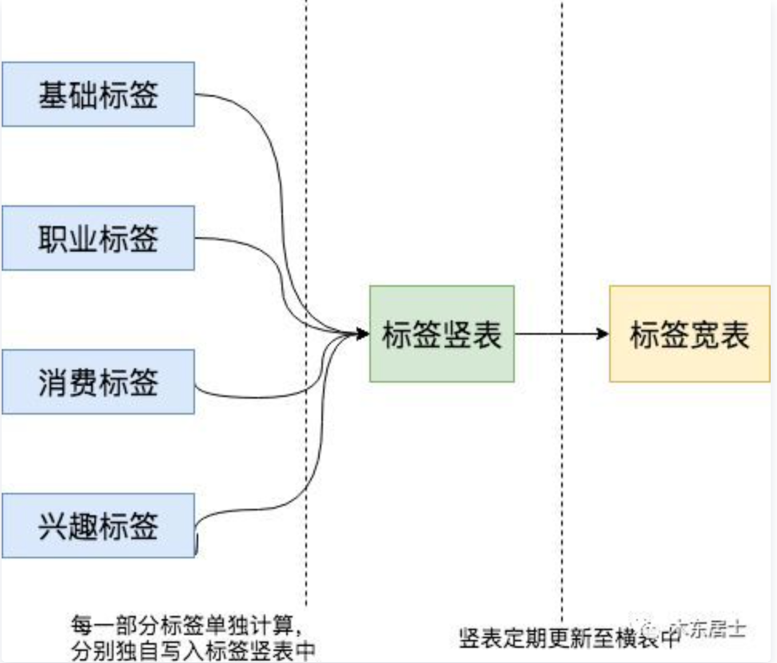

# 标签数据开发

## 标签数据存储

### 数据模型设计

用户画像，即用户信息标签化，站在数仓开发的角度来看，即是将数仓中建模好的数据，包括业务数据与用户埋点数据，基于一定的统计、规则、算法将数仓中的数据加工成用户标签树。数仓建模、分层的方法这里不做多的介绍，按照规范，用户画像的输入数据为Hive中DWD表，输出为DWS层。重点考虑标签表的设计。Hive存储标签相关的数据涉及到的一些表：

- 用户标签表
- 标签聚合的表
- 人群计算的表


#### 宽表

如果将用户标签开发成一张大的宽表，以Hive为例，我们最常用的就是宽表，也就是一个 key，跟上它的所有标签。比如下面是一个简单的宽表。

| 用户ID | 性别 | 年龄 | 学历 | 职业   | 月薪    | 月消费能力 |
| :----- | :--- | :--- | :--- | :----- | :------ | :--------- |
| 001    | 男   | 28   | 本科 | 程序员 | 10k-20k | 1k-2k      |
| 002    | 女   | 23   | 大专 | 销售   | 不详    | 100-200    |

那么用宽表有什么问题吗？

- 由于用户的标签会非常多，而且随着用户画像的深入，会有很多细分领域的标签，这就意味着标签的数量会随时增加，而且可能会很频繁。
- 不同的标签计算频率不同，比如说学历一周计算一次都是可以接收的，但是APP登录活跃情况却可能需要每天都要计算。
- 计算完成时间不同，如果是以宽表的形式存储，那么最终需要把各个小表的计算结果合并，此时如果出现了一部分结果早上3点计算完成，一部分要早上10点才能计算完成，那么宽表最终的生成时间就要很晚。
- 大量空缺的标签会导致存储稀疏，有一些标签会有很多的缺失，这在用户画像中很常见。

当标签数量较多的时候，我们必须考虑以上问题，且增加ETL任务的时间，维护困难。

#### 竖表

竖表即是将userId + 标签ID作为分组的key存储。竖表其实就是将标签都拆开，一个用户有多少标签，那么在这里面就会有几条数据。

| 用户ID | 标签名       | 标签值  |
| :----- | :----------- | :------ |
| 001    | sex          | 男      |
| 001    | salary_month | 10k-20k |
| 002    | sex          | 女      |
| 002    | age          | 23      |

竖表能比较好地解决上面宽表的问题。但是它也会带来了新的问题，比如说多标签组合的查询需求：“我们想看年龄在23-30之间，月薪在10-20k之间，喜欢听古典音乐的女性”，这种多标签查询条件组合情况在竖表中就不太容易支持。

#### 横表+竖表

如前面所分析，竖表和横表各有所长和所短，那么能不能两者结合呢？

这其实也要考虑横表和竖表的特性，整体来讲就是竖表对计算层支持的好，横表对查询层支持的好。那么设计的化就可以这样：



所以Hive中的各个维度的用户标签相关的表结构采用竖表的设计：

```sql
CREATE TABLE IF NOT EXISTS dws_user_profile_attritube
(
    user_id STRING COMMENT '用户id',
    value   STRING COMMENT '标签权重'
) 
COMMENT '人口属性维度用户标签表'
PARTITIONED BY
(
    dt      STRING COMMENT '日期分区',
    tag_id  STRING COMMENT '标签id'
);
```

